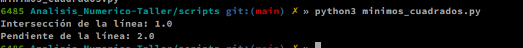
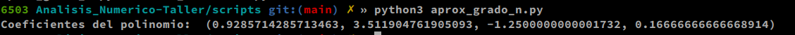
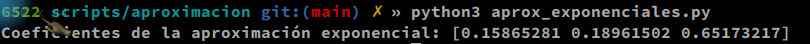
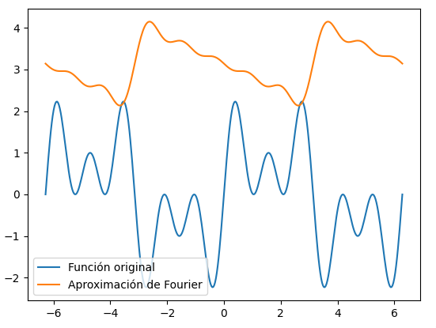
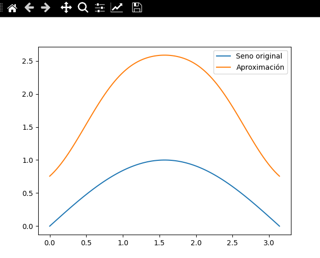
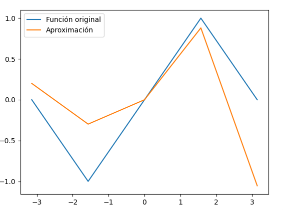
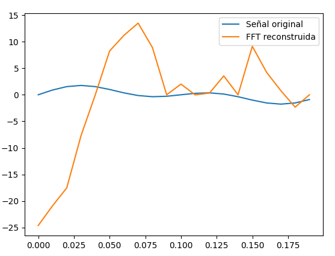

# Proyecto Análisis Numérico
### Rodrigo Castillo Camargo
### Análisis Numérico
###### Universidad del Rosario

# Parte 1 - Teoría de la aproximación

### ¿En qué consiste la teoría de la aproximación?
- Datos $m+1$ puntos $(x_0 , y_0) , ... , (x_m , y_m)$ encontrar una función que se aproxime lo suficiente.

Para ésto, existe el concepto de interpolación mediante el polinomio de Lagrange, sin embargo...

1. En la interpolación dados $m$ puntos,  necesitaremos un polinomio de grado $m-1$
2. En la aproximación, si se tienen $m$ puntos, el polinomio puede ser de grado $n$ tal que $0 < n < m$

Esto porque la interpolación tiene mucha varianza, ya que retorna un polinomio que se acompla exactamente a los puntos que se le dan.

### Idea general
$Error = ||y - p(x)||$

en donde se pueden definir dos tipos de normas:

1. $||*||$ 

2. $||*||_1$

- La idea general de la aproximación es encontrar un polinomio que minimice el error, definiendo el error con las normas especificadas.

#### Método de mínimos cuadrados lineales:
El método de mínimos cuadrados lineales es un algoritmo utilizado en teoría de la aproximación para encontrar la mejor aproximación lineal a un conjunto de datos. En términos generales, la idea es encontrar una línea recta que pase lo más cerca posible de todos los puntos de datos.

El método de mínimos cuadrados lineales se basa en el principio de que la mejor aproximación lineal es aquella que minimiza la suma de los cuadrados de las diferencias entre los valores reales y los valores predichos por la línea recta. Es decir, se busca la línea que minimiza la función:

###### Implementación: 

```python
def linear_regression(x, y):
    n = len(x)
    x_mean = sum(x) / n
    y_mean = sum(y) / n
    
    xy_sum = 0
    x_squared_sum = 0
    
    for i in range(n):
        xy_sum += x[i] * y[i]
        x_squared_sum += x[i] ** 2
    
    # Calcular los coeficientes de la línea recta
    b = (xy_sum - n * x_mean * y_mean) / (x_squared_sum - n * x_mean ** 2)
    a = y_mean - b * x_mean
    
    return a, b
    
# Datos
x = [1, 2, 3, 4, 5]
y = [3, 5, 7, 9, 11]

# Calcular los coeficientes de la línea recta
a, b = linear_regression(x, y)

# Imprimir los coeficientes
print("Intersección de la línea:", a)
print("Pendiente de la línea:", b)
```



#### Aproximación de grado n

- En una aproximación de grado n, se busca ajustar un polinomio de grado n a los datos observados. En lugar de una línea recta como en la regresión lineal(mínimos cuadrados lineales) , se utiliza una función polinómica de grado n para modelar la relación entre las variables

###### Implementación

```python
import numpy as np
def polynomial_regression(x, y, n):
    # Construir la matriz de diseño
    X = []
    for i in range(len(x)):
        row = [x[i]**j for j in range(n+1)]
        X.append(row)
    
    # Convertir a arrays
    X = np.array(X)
    y = np.array(y)
    
    # Calcular los coeficientes utilizando el método de mínimos cuadrados
    X_transpose = np.transpose(X)
    X_transpose_X = np.dot(X_transpose, X)
    X_transpose_y = np.dot(X_transpose, y)
    coeffs = np.linalg.solve(X_transpose_X, X_transpose_y)
    
    return tuple(coeffs)


x = [0, 1, 2, 3, 4, 5]
y = [1, 3, 5, 4, 6, 8]

coeffs = polynomial_regression(x, y, 3)

print("Coeficientes del polinomio: ", coeffs)
```


#### Aproximaciones exponenciales

- En el análisis numérico y la teoría de aproximación, el algoritmo de aproximaciones exponenciales se refiere a un algoritmo utilizado para aproximar una función mediante una combinación lineal de funciones exponenciales.

- La idea básica detrás del método de aproximaciones exponenciales es que cualquier función suave puede aproximarse mediante una combinación lineal de funciones exponenciales de la forma: 
$$
f(x) \approx \sum_{i} c_i e^{\alpha_i x}
$$

###### Implementación


```python
import numpy as np

def exponential_approximation(x, y, n, alpha, c):
    A = np.zeros((len(x), n+1))
    for i in range(len(x)):
        A[i,0] = 1
        for j in range(n):
            A[i,j+1] = np.exp(alpha[j]*x[i])
    c = np.linalg.lstsq(A, y, rcond=None)[0]
    return c

# Datos de ejemplo
x = np.array([0, 1, 2])
y = np.array([1, 2, 5])
n = 2
alpha = np.array([-1, 1])
c = np.zeros(n+1)

# Calcular los coeficientes de la aproximación exponencial
c = exponential_approximation(x, y, n, alpha, c)

# Imprimir los coeficientes
print("Coeficientes de la aproximación exponencial:", c)
```



#### Series de Fourier

- El método de aproximación por series de Fourier es un método utilizado en la teoría de la aproximación para aproximar funciones periódicas mediante la suma de una serie de funciones sinusoidales y cosinusoidales.

- En particular, la serie de Fourier de una función f(x) periódica con período 2L se define como:

$$
f(x) \approx \frac{a_0}{2} + \sum_{n=1}^\infty \left[ a_n \cos\left(\frac{n\pi x}{L}\right) + b_n \sin\left(\frac{n\pi x}{L}\right) \right]
$$

###### Implementación

*x Implementé una serie de taylor con el grado del polinomio n=5*
```python
import math
import matplotlib.pyplot as plt

# Función a aproximar
def f(x):
    return math.sin(x) + math.sin(3*x) + math.sin(5*x)

# Coeficientes de Fourier
def a(n):
    if n == 0:
        return 2*math.pi
    else:
        return 0

def b(n):
    return 2*(-1)**n / (n*math.pi)

# Aproximación mediante la serie de Fourier
def fourier_series(x, n):
    s = a(0)/2
    for i in range(1, n+1):
        s += a(i) * math.cos(i*x) + b(i) * math.sin(i*x)
    return s

# Intervalo de evaluación
x_vals = [i*math.pi/100 for i in range(-200, 201)]

# Evaluar la función original
y_vals = [f(x) for x in x_vals]

# Evaluar la aproximación por la serie de Fourier
n = 5
y_fourier = [fourier_series(x, n) for x in x_vals]

# Graficar los resultados
plt.plot(x_vals, y_vals, label="Función original")
plt.plot(x_vals, y_fourier, label="Aproximación de Fourier")
plt.legend()
plt.show()
```


#### Polinomios ortogonales trigonométricos
El método de aproximación mediante polinomios ortogonales trigonométricos es un método de la teoría de la aproximación que se utiliza para aproximar funciones periódicas. Se basa en la idea de que cualquier función periódica puede ser aproximada mediante una serie trigonométrica de la forma:

$$
f(x) \approx a_0 + \sum_{n=1}^{\infty} [a_n \cos(n x) + b_n \sin(n x)]
$$

Donde los coeficientes $a_n$ y $b_n$ se calculan de la siguiente manera:

1. $a_n = \frac{1}{\pi} \int_{-\pi}^{\pi} f(x) \cos(n x) dx$
2. $b_n = \frac{1}{\pi} \int_{-\pi}^{\pi} f(x) \sin(n x) dx$

###### Implementación:

```python
import numpy as np
import matplotlib.pyplot as plt
from scipy.special import jn  # Función Bessel de primera especie

def trigonometric_approximation(x, y, degree):
    n = len(x)
    a = np.zeros(degree+1)
    b = np.zeros(degree+1)
    for k in range(degree+1):
        a[k] = (2/n)*np.sum(y*np.cos(k*np.array(x)))
        b[k] = (2/n)*np.sum(y*np.sin(k*np.array(x)))
    p = np.zeros(n)
    for k in range(degree+1):
        p += a[k]*np.cos(k*np.array(x)) + b[k]*np.sin(k*np.array(x))
    c = np.zeros(degree+1)
    for k in range(degree+1):
        c[k] = np.sqrt(a[k]**2 + b[k]**2)
    return p, c


# Definir la función seno en el intervalo [0, pi]
x = np.linspace(0, np.pi, 100)
y = np.sin(x)

# Aproximación mediante polinomios ortogonales trigonométricos de grado 5
p, c = trigonometric_approximation(x, y, degree=5)

# Graficar la función original y la aproximación
plt.plot(x, y, label='Seno original')
plt.plot(x, p, label='Aproximación')
plt.legend()
plt.show()
```


#### Aproximación trigonométrica discreta:


-El método de aproximación trigonométrica discreta es una técnica utilizada en teoría de aproximación para aproximar una función mediante una combinación lineal de funciones trigonométricas discretas. Se realiza utilizando la siguiente formula:

$$
f(x) \approx a_0 + \sum_{k=1}^{n} [a_k \cos(kx) + b_k \sin(kx)]
$$

donde $a_0$, $a_k$ y $b_k$ son coeficientes que se determinan a partir de la función que se desea aproximar y $n$ es el número de términos utilizados en la aproximación.


#### Implementación

```python
import numpy as np
import matplotlib.pyplot as plt

def DFT(f):
    N = len(f)
    c = np.zeros(N, dtype=complex)
    for k in range(N):
        for n in range(N):
            c[k] += f[n] * np.exp(-2j*np.pi*k*n/N)
    return c

def IDFT(c):
    N = len(c)
    f = np.zeros(N, dtype=complex)
    for n in range(N):
        for k in range(N):
            f[n] += c[k] * np.exp(2j*np.pi*k*n/N)
        f[n] /= N
    return f

def trig_approx(f, M):
    N = len(f)
    L = N/2
    x = np.linspace(-L, L, N+1)[:-1]
    c = DFT(f)
    cf = np.zeros(N, dtype=complex)
    cf[0] = c[0]/N
    for m in range(1,M+1):
        cf[m] = c[m]/N
        cf[-m] = c[-m]/N
    return lambda x: np.real(np.sum(cf[k] * np.exp(2j*np.pi*k*x/L) for k in range(-M,M+1)))

# Ejemplo de uso
f = lambda x: np.sin(x)
M = 2
N = 2*M+1
L = np.pi
x = np.linspace(-L,L,N)
f_vals = f(x)
f_approx = trig_approx(f_vals, M)

plt.plot(x, f_vals, label='Función original')
plt.plot(x, f_approx(x), label='Aproximación')
plt.legend()
plt.show()
```




#### Transformada rápida de Fourier

- La Transformada Rápida de Fourier (FFT, por sus siglas en inglés) es un algoritmo que permite calcular la transformada de Fourier discreta (DFT) de una secuencia de datos de manera más rápida que utilizando el método directo de la DFT. Es un algoritmo de divide y vencerás 

#### Implementación

```python
import math
import matplotlib.pyplot as plt

def FFT(f):
    # Calcula la FFT de una señal f
    N = len(f)
    if N == 1:
        return f
    else:
        Feven = FFT([f[i] for i in range(0, N, 2)])
        Fodd = FFT([f[i] for i in range(1, N, 2)])
        combined = [0] * N
        for m in range(N//2):
            combined[m] = Feven[m] + math.e**(-2j*math.pi*m/N)*Fodd[m]
            combined[m + N//2] = Feven[m] - math.e**(-2j*math.pi*m/N)*Fodd[m]
        return combined

# Crear un arreglo de puntos de prueba
t = [i/100 for i in range(20)]
f = [math.sin(2*math.pi*5*i) + math.sin(2*math.pi*10*i) for i in t]

# Calcular la transformada rápida de fourier de los puntos
f_fft = FFT(f)

# Calcular la frecuencia de cada muestra en los puntos original
freq = [i/(t[-1]-t[0]) for i in range(len(t))]

# Graficar los puntos original y los puntos reconstruidos de la FFT
f_ifft = [i.real for i in FFT(f_fft[::-1])] # Calcula la transformada inversa de Fourier
plt.plot(t, f, label='Señal original')
plt.plot(t, f_ifft, label='FFT reconstruida')
plt.legend()
plt.show()
```


### Tabla de comparación de métodos:

| Método                                                       | Ventajas                                             | Desventajas                                                   | Bueno para                                     | Malo para                               |
|--------------------------------------------------------------|------------------------------------------------------|---------------------------------------------------------------|------------------------------------------------|-----------------------------------------|
| Aproximación por espacios de funciones                       | Versatilidad en la elección de funciones base        | La elección de las funciones puede ser complicada             | Funciones complicadas                          | Datos con patrones no lineales          |
| Aproximación por series de Fourier                           | Buena aproximación de funciones periódicas           | Puede ser difícil de ajustar a funciones no periódicas        | Funciones periódicas                           | Funciones no periódicas                 |
| Aproximación por series de Taylor                            | Aproximación exacta en un punto                      | Sólo es válido localmente, puede diverger lejos del punto     | Funciones analíticas en un punto               | Funciones no analíticas, singularidades |
| Aproximación mediante polinomios ortogonales trigonométricos | Convergencia uniforme rápida                         | La elección de los polinomios puede ser complicada            | Funciones periódicas, datos con ruido          | Funciones no periódicas                 |
| Aproximación trigonométrica discreta                         | Simple y eficiente                                   | Puede tener dificultades para aproximar funciones complicadas | Funciones periódicas, datos con ruido          | Funciones no periódicas                 |
| Transformada rápida de Fourier (FFT)                         | Eficiente para cálculo en grandes conjuntos de datos | Requiere una elección adecuada de la resolución               | Análisis de señales, procesamiento de imágenes | Funciones no periódicas                 |

### Tabla de tiempos computacionales y memorias

    | Método                         | Aproximación          | Big Oh       | Memoria  |
    |--------------------------------|-----------------------|--------------|----------|
    | Ajuste de mínimos cuadrados    | Funciones arbitrarias | $O(n^3)$     | $O(n^2)$ |
    | Polinomios de Taylor           | Funciones analíticas  | $O(n^2)$     | $O(n)$   |
    | Serie de Fourier               | Funciones periódicas  | $O(n\log n)$ | $O(n)$   |
    | Polinomios trigonométricos     | Funciones periódicas  | $O(n^2)$     | $O(n)$   |
    | Transformada Rápida de Fourier | Funciones periódicas  | $O(n\log n)$ | $O(n)$   |

---


# Parte 2 - Métodos Iterativos.

## Introducción

- En el análisis numérico, los métodos iterativos son una clase de algoritmos que se utilizan para resolver sistemas de ecuaciones lineales de la forma $Ax=b$, donde $A$ es una matriz cuadrada y $x$ y $b$ son vectores.

- Los métodos iterativos se pueden clasificar en dos categorías principales: los métodos iterativos directos y los métodos iterativos indirectos (o métodos iterativos de punto fijo)

### Métodos directos:

Los métodos iterativos directos resuelven el sistema de ecuaciones lineales mediante la aplicación de un número finito de operaciones aritméticas y algebraicas básicas, que producen una solución exacta después de un número fijo de pasos. Algunos ejemplos de métodos iterativos directos son la eliminación de Gauss-Jordan y la factorización LU.

### Métodos indirectos: 

Los métodos iterativos indirectos (o de punto fijo) resuelven el sistema de ecuaciones lineales mediante la aplicación repetida de una fórmula de recurrencia que produce una secuencia de vectores que se acercan gradualmente a la solución exacta del sistema. Algunos ejemplos de métodos iterativos indirectos son el método de Jacobi, el método de Gauss-Seidel y el método de relajación.

#### Diferencias:

| Ventajas de los métodos iterativos indirectos                                                                                                                      | Desventajas de los métodos iterativos indirectos                                                                |
| --------------------------------------------                                                                                                                       | -----------------------------------------------                                                                 |
| - Requieren menos memoria que los métodos directos, lo que los hace adecuados para sistemas grandes y dispersos.                                                   | - Pueden converger lentamente o no converger en absoluto para algunos sistemas.                                 |
| - Se pueden aplicar a matrices no simétricas y no definidas positivas.                                                                                             | - Pueden ser más difíciles de implementar y ajustar que los métodos directos.                                   |
| - Son más eficientes en términos de tiempo computacional para matrices dispersas.                                                                                  | - Pueden requerir un conocimiento previo de la matriz para establecer los parámetros de convergencia adecuados. |
| - Son iterativos, lo que permite la posibilidad de una interrupción temprana si se alcanza una solución aceptable antes de que se completen todas las iteraciones. | - Pueden ser más susceptibles a errores de redondeo que los métodos directos.                                   |
| - Permiten la aplicación de técnicas de precondicionamiento que mejoran su eficiencia.                                                                             | - Pueden requerir más iteraciones que los métodos directos para alcanzar la solución deseada.                   |
| son buenos para solucionar matrices escasas (matrices que tienen muchos 0's y pocos 1's                                                                                                                        | no son buenos para solucionar matrices escasas                                                                  |


### Con respecto a los métodos directos:


#### Eliminación Gaussiana

El método de eliminación Gaussiana es un algoritmo utilizado para resolver sistemas de ecuaciones lineales. Consiste en aplicar una serie de operaciones elementales de filas sobre la matriz aumentada del sistema, con el objetivo de transformarla en una matriz triangular superior.

La matriz aumentada del sistema se construye colocando la matriz de coeficientes y el vector de términos independientes en una misma matriz, es decir, si tenemos un sistema de ecuaciones lineales de la forma:


$a11*x1 + a12*x2 + a13*x3 + ... + a1n*xn = b1$

$a21*x1 + a22*x2 + a23*x3 + ... + a2n*xn = b2$

$a31*x1 + a32*x2 + a33*x3 + ... + a3n*xn = b3$

...

$an1*x1 + an2*x2 + an3*x3 + ... + ann*xn = bn$

entonces la matriz correspondiente es


| a11  a12  a13  ...  a1n  | b1 |
| a21  a22  a23  ...  a2n  | b2 |
| a31  a32  a33  ...  a3n  | b3 |
| ...  ...  ...  ...  ...  | ...|
| an1  an2  an3  ...  ann  | bn |

Una vez construida la matriz aumentada, se aplica el siguiente proceso iterativo:

1. Se elige la primera columna y se busca el elemento no nulo más cercano a la diagonal, que llamaremos pivote.

2. Si el pivote no está en la diagonal, se intercambian las filas para que el pivote quede en la posición (i, i).

3. Se eliminan los elementos debajo del pivote, restándole a cada fila un múltiplo de la fila que contiene el pivote, de tal forma que los elementos debajo del pivote queden en cero.

4. Se repite el proceso con la siguiente columna, ignorando las filas y columnas anteriores ya transformadas.

5. Finalmente, se obtiene una matriz triangular superior que se puede resolver fácilmente mediante sustitución hacia atrás

El método de eliminación Gaussiana es muy útil para resolver sistemas de ecuaciones lineales grandes y para encontrar la inversa de una matriz. Sin embargo, su desventaja es que puede ser computacionalmente costoso para matrices muy grandes, ya que requiere de muchas operaciones elementales de filas.


##### Implementación de eliminación gaussiana

```python
import numpy as np

# Definir función de eliminación gaussiana
def eliminacion_gaussiana(A, b):
    n = len(b)
    for k in range(n-1):
        for i in range(k+1, n):
            factor = A[i,k]/A[k,k]
            A[i,k+1:n] = A[i,k+1:n] - factor*A[k,k+1:n]
            b[i] = b[i] - factor*b[k]
    return A, b

# Resolver un sistema de ecuaciones utilizando eliminación gaussiana
A = np.array([[2, 1, -1], [-3, -1, 2], [-2, 1, 2]], dtype=np.float64)
b = np.array([8, -11, -3], dtype=np.float64)

A_triang, b_triang = eliminacion_gaussiana(A, b)

n = len(b)
x = np.zeros(n, dtype=np.float64)
x[n-1] = b_triang[n-1]/A_triang[n-1,n-1]
for i in range(n-2, -1, -1):
    x[i] = (b_triang[i] - np.dot(A_triang[i,i+1:n], x[i+1:n]))/A_triang[i,i]

# Imprimir la solución por pantalla
print("La solución del sistema Ax=b es:")
print(x)
```

#### Factorización LU

El método de factorización LU es un método numérico utilizado para resolver sistemas de ecuaciones lineales de la forma Ax = b, donde A es una matriz cuadrada y b es un vector de términos independientes. La idea del método es descomponer la matriz A en dos matrices, L y U, de manera que A = LU. La matriz L es una matriz triangular inferior con unos en su diagonal principal, mientras que la matriz U es una matriz triangular superior. Una vez que se ha realizado esta descomposición, se puede resolver el sistema Ax = b en dos etapas: primero se resuelve el sistema Ly = b utilizando sustitución hacia adelante, y luego se resuelve el sistema Ux = y utilizando sustitución hacia atrás.

La ventaja de la factorización LU sobre los métodos iterativos y los métodos directos de eliminación gaussiana es que una vez que se ha realizado la descomposición LU, se puede resolver el sistema Ax = b para cualquier valor de b de manera eficiente. Esto es útil en situaciones en las que se necesita resolver el mismo sistema de ecuaciones con diferentes valores de b, como en la resolución de sistemas de ecuaciones diferenciales parciales.

La desventaja de la factorización LU es que puede ser computacionalmente costosa en términos de memoria y cálculo, ya que se deben calcular y almacenar dos matrices nuevas, L y U, además de la matriz original A. Además, si la matriz A tiene elementos diagonales pequeños o ceros, la factorización LU puede ser inestable numéricamente y puede producir soluciones imprecisas.

#### Implementación

```python
import numpy as np

def factorizacionLU(A):
    """
    Función que realiza la factorización LU de una matriz A.
    Devuelve dos matrices L y U tales que A = LU.
    """
    n = A.shape[0]
    L = np.zeros((n, n))
    U = np.zeros((n, n))

    for j in range(n):
        U[0, j] = A[0, j]
        L[j, 0] = A[j, 0] / U[0, 0]

    for i in range(1, n):
        for j in range(i, n):
            s1 = sum(U[k, j] * L[i, k] for k in range(i))
            U[i, j] = A[i, j] - s1

        for j in range(i, n):
            s2 = sum(U[k, i] * L[j, k] for k in range(i))
            L[j, i] = (A[j, i] - s2) / U[i, i]

    np.fill_diagonal(L, 1)
    return L, U


A = np.array([[4, -1, 0],
              [-1, 4, -1],
              [0, -1, 4]])

b = np.array([12, 1, 2])

L, U = factorizacionLU(A)

y = np.zeros_like(b)
for i in range(len(b)):
    y[i] = b[i] - np.dot(L[i,:i], y[:i])

x = np.zeros_like(b)
for i in reversed(range(len(b))):
    x[i] = (y[i] - np.dot(U[i,i+1:], x[i+1:])) / U[i,i]

print("La solución del sistema Ax = b es:")
print(x)
```


### Con respecto a los métodos indirectos:

#### Método de jacobi

El método de Jacobi es un método iterativo utilizado para resolver sistemas de ecuaciones lineales de la forma $Ax=b$, donde $A$ es una matriz cuadrada y $x$ y $b$ son vectores. Este método es uno de los métodos iterativos más simples y populares en el análisis numérico.

El método de Jacobi comienza con una aproximación inicial $x^{(0)}$ de la solución $x$ y luego produce una secuencia de vectores $x^{(1)}, x^{(2)}, \dots, x^{(k)}$ que se acercan gradualmente a la solución exacta. En cada iteración, el método de Jacobi actualiza cada componente de $x^{(k)}$ mediante la siguiente fórmula:

$$
x_i^{(k+1)} = \frac{1}{a_{ii}}\left(b_i - \sum_{j \neq i}a_{ij}x_j^{(k)}\right), \quad i = 1, \dots, n
$$

donde $n$ es la dimensión de la matriz $A$ y $a_{ij}$ es el elemento de la matriz $A$ en la fila $i$ y la columna $j$. La fórmula actualiza cada componente $x_i^{(k+1)}$ de $x^{(k+1)}$ utilizando los valores antiguos de los componentes $x_j^{(k)}$ para $j \neq i$.

###### Implementación

```python
import numpy as np

def jacobi(A, b, x0, tol, max_iter):
    n = len(A)
    x = np.copy(x0)
    x_prev = np.zeros(n)
    iter = 0
    while iter < max_iter and np.linalg.norm(x - x_prev) > tol:
        x_prev = np.copy(x)
        for i in range(n):
            x[i] = (b[i] - np.dot(A[i, :n], x_prev) + A[i, i] * x_prev[i]) / A[i, i]
        iter += 1
    return x

# Ejemplo de uso
A = np.array([[10, 2, 1], [1, 5, 1], [2, 3, 10]])
b = np.array([7, -8, 6])
x0 = np.array([0, 0, 0])
tol = 1e-8
max_iter = 1000

sol = jacobi(A, b, x0, tol, max_iter)

print("La solución es:", sol)
```


#### Método de Gauss Seidel

En el método de Gauss-Seidel, se utiliza la misma idea que en el método de Jacobi, es decir, se despeja cada variable de una ecuación lineal del sistema y se actualiza de forma iterativa. Sin embargo, en lugar de utilizar todas las aproximaciones anteriores para todas las variables, se utiliza la aproximación más reciente para las variables que ya han sido actualizadas en la misma iteración. De esta manera, el método de Gauss-Seidel puede converger más rápido que el método de Jacobi.

La fórmula de actualización del método de Gauss-Seidel es similar a la del método de Jacobi, pero en lugar de utilizar todas las aproximaciones anteriores en cada iteración, se utilizan las más recientes. La fórmula es la siguiente:

$$
x_i^{(k+1)}=\frac{1}{a_{ii}}\left(b_i-\sum_{j<i}a_{ij}x_j^{(k+1)}-\sum_{j>i}a_{ij}x_j^{(k)}\right), \quad i=1,\dots,n
$$

#### Implementación

```python
def gauss_seidel(A, b, x0, tol, max_iter):
    n = len(b)
    x = x0.copy()
    k = 0
    err = tol + 1

    while err > tol and k < max_iter:
        x_old = x.copy()
        for i in range(n):
            x[i] = (b[i] - sum(A[i][j] * x[j] for j in range(i)) - sum(A[i][j] * x[j] for j in range(i + 1, n))) / A[i][i]
        err = max(abs(x[i] - x_old[i]) for i in range(n))
        k += 1

    return x, k

# Definir la matriz de coeficientes y el vector de términos independientes
A = [[4, -1, 0, 0],
     [-1, 4, -1, 0],
     [0, -1, 4, -1],
     [0, 0, -1, 3]]

b = [15, 10, 10, 10]

# Definir el vector de aproximación inicial, la tolerancia y el número máximo de iteraciones
x0 = [0, 0, 0, 0]
tol = 1e-6
max_iter = 1000

# Resolver el sistema de ecuaciones lineales mediante el método de Gauss-Seidel
x, k = gauss_seidel(A, b, x0, tol, max_iter)

# Mostrar la solución por pantalla
print("La solución del sistema es:")
for i in range(len(x)):
    print(f"x_{i} = {x[i]:.6f}")

print(f"\nSe realizaron {k} iteraciones.")
```


### Comparación de métodos

| Método                | Ventajas                                                                                                                    | Desventajas                                                              | Mejor para                                        |
|-----------------------|-----------------------------------------------------------------------------------------------------------------------------|--------------------------------------------------------------------------|---------------------------------------------------|
| Eliminación Gaussiana | Fácil de implementar                                                                                                        | puede requerir mucho tiempo y memoria en sistemas grandes                | casi todos los sistemas (excepto Sparce Matrixes) |
| Factorización LU      | Puede ser más rápido que la eliminación gaussiana si la matriz se factoriza una vez y luego se resuelven múltiples sistemas | Requiere más memoria que la eliminación gaussiana pues genera 2 matrices |
| Método de Jacobi      | Converge si la matriz es diagonal dominante                                                                                 | Lento para matrices grandes , puede no converger                         |
| Gauss Seidel          | Converge más rápido que el método de Jacobi                                                                                 | No siempre converge                                                      |


###### Referencias:
1. Libro de la clase
2. Talleres del curso subidos a E-aulas
3. Numerical Analysis de Timothy Sauer 
4. Numerical Recipes de Press et al.

